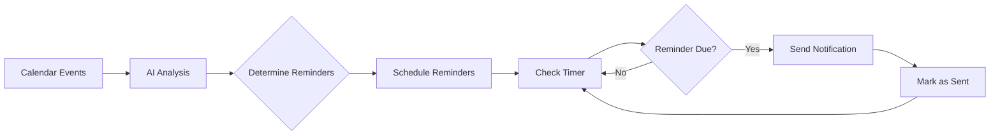

# 🤖 AI-Powered Calendar Reminder Bot

An intelligent bot that monitors your Google Calendar and sends smart reminders via **Email** and **Telegram**. Powered by Google's Gemini AI, it understands your events and determines the optimal reminder schedule for each one.

## ✨ Features

### 🧠 **AI-Powered Intelligence**

- **Natural Language Summaries**: Get friendly, contextual descriptions of your events
- **Smart Reminder Timing**: AI analyzes each event to determine the best reminder schedule
- **Context-Aware**: Considers location, duration, attendees, and importance
- **Travel Time Awareness**: Automatically calculates travel time for location-based events
- **Dynamic Reminder Count**: Important events get more reminders

### 📢 **Multi-Channel Notifications**

- **Email**: Receive rich HTML-formatted reminders in your inbox
- **Telegram**: Get instant notifications on your phone
- **Flexible**: Enable either or both channels

### 📅 **Google Calendar Integration**

- Seamless OAuth 2.0 authentication
- Reads all upcoming events from your primary calendar
- Supports all-day events and recurring events
- Respects your timezone

### 🔄 **Automatic & Reliable**

- Runs continuously in the background
- Checks calendar every 15 minutes (configurable)
- Never sends duplicate reminders
- SQLite database tracks sent notifications

## 🚀 Quick Start

### Prerequisites

- Python 3.8+
- Google account with Google Calendar
- Google Gemini API key (free)
- Email account OR Telegram bot

### Installation

1. **Clone the repository**

   ```bash
   git clone <repository-url>
   cd BotReminder
   ```

2. **Install dependencies**

   ```bash
   pip install -r requirements.txt
   ```

3. **Set up Google Calendar API**

   - Follow the detailed steps in [setup_guide.md](setup_guide.md)
   - Download OAuth credentials to `credentials/credentials.json`

4. **Get Gemini API Key**

   - Visit [Google AI Studio](https://makersuite.google.com/app/apikey)
   - Create an API key

5. **Configure the bot**

   ```bash
   copy .env.example .env
   ```

   Edit `.env` with your credentials (see [setup_guide.md](setup_guide.md) for details)

6. **Run the bot**
   ```bash
   python main.py --test    # Test notifications
   python main.py           # Run continuously
   ```

## 📖 How It Works



1. **Fetch Events**: Bot retrieves upcoming events from your Google Calendar
2. **AI Analysis**: Gemini AI analyzes each event:
   - Generates a natural language summary
   - Rates importance (1-10)
   - Determines optimal reminder times based on context
3. **Smart Scheduling**: Creates reminder schedule considering:
   - Event location (adds travel time buffer)
   - Event duration (longer = more prep time)
   - Number of attendees (more people = more important)
   - Event type detected from title/description
4. **Notification Delivery**: Sends reminders via your chosen channels
5. **Tracking**: Prevents duplicate notifications using SQLite database

## 🎯 Example Reminder Strategies

### Meeting at a New Location (2 hours, 5 attendees)

- **24 hours before**: "Tomorrow: Team Strategy Meeting at Downtown Office - Review agenda and prepare presentation materials"
- **2 hours before**: "In 2 hours: Team Strategy Meeting - Time to head out (estimated 30min travel)"
- **15 minutes before**: "Starting soon: Team Strategy Meeting"

### Quick Virtual Call (30 minutes, 1 other person)

- **1 hour before**: "In 1 hour: Quick Sync Call with John"
- **10 minutes before**: "In 10 minutes: Quick Sync Call"

### All-Day Event

- **24 hours before**: "Tomorrow: Company Holiday - Office closed"

## 🛠️ Configuration

All settings are in `.env`:

```env
# Required
GEMINI_API_KEY=your_api_key
GOOGLE_CREDENTIALS_PATH=credentials/credentials.json

# Notification Channels (at least one required)
ENABLE_EMAIL=true
ENABLE_TELEGRAM=true

# Email Settings
EMAIL_SMTP_SERVER=smtp.gmail.com
EMAIL_SMTP_PORT=587
EMAIL_ADDRESS=you@gmail.com
EMAIL_PASSWORD=your_app_password

# Telegram Settings
TELEGRAM_BOT_TOKEN=your_bot_token
TELEGRAM_CHAT_ID=your_chat_id

# Bot Behavior
CHECK_INTERVAL_MINUTES=15
TIMEZONE=Europe/Madrid
```

See [.env.example](.env.example) for all options.

## 📋 Usage

### Run Continuously (Normal Mode)

```bash
python main.py
```

Bot runs forever, checking calendar every 15 minutes.

### Test Notifications

```bash
python main.py --test
```

Sends a test notification to verify setup.

### Single Check (Testing/Debugging)

```bash
python main.py --once
```

Checks calendar once and exits. Useful for testing.

## 📁 Project Structure

```
BotReminder/
├── src/
│   ├── __init__.py
│   ├── config.py              # Configuration management
│   ├── calendar_service.py    # Google Calendar API
│   ├── ai_service.py          # Gemini AI integration
│   ├── notification_service.py # Email & Telegram
│   ├── reminder_db.py         # SQLite database
│   ├── scheduler.py           # Main scheduler logic
│   └── utils/
│       ├── __init__.py
│       └── logger.py          # Logging setup
├── credentials/               # OAuth credentials (gitignored)
├── main.py                    # Entry point
├── requirements.txt           # Dependencies
├── .env.example              # Configuration template
├── setup_guide.md            # Detailed setup instructions
└── README.md                 # This file
```

## 🔧 Advanced Customization

### Adjust AI Prompts

Modify prompts in `src/ai_service.py` to customize how the AI analyzes events.

### Change Reminder Logic

Edit `src/scheduler.py` to adjust when reminders are considered "due".

### Custom Notification Formats

Modify `src/notification_service.py` to change message formatting.

## 🐛 Troubleshooting

See [setup_guide.md](setup_guide.md) for detailed troubleshooting.

**Common Issues:**

- **"Configuration errors"**: Check your `.env` file
- **"Authentication failed"**: Re-run first-time setup, delete `token.json`
- **"No reminders sent"**: Ensure you have upcoming calendar events
- **Email not working**: Use Gmail App Password, not regular password
- **Telegram not working**: Verify bot token and chat ID

## 🤝 Contributing

Contributions welcome! Feel free to:

- Report bugs
- Suggest features
- Submit pull requests

## 📄 License

This project is licensed under the MIT License - see the [LICENSE](LICENSE) file for details.

## 🙏 Acknowledgments

- **Google Calendar API** for calendar integration
- **Google Gemini** for AI-powered analysis
- **Python Telegram Bot** for Telegram integration

## 📞 Support

For issues and questions:

1. Check [setup_guide.md](setup_guide.md)
2. Review logs in `bot.log`
3. Open an issue on GitHub

---

**Made with ❤️ to never miss important events again!**
